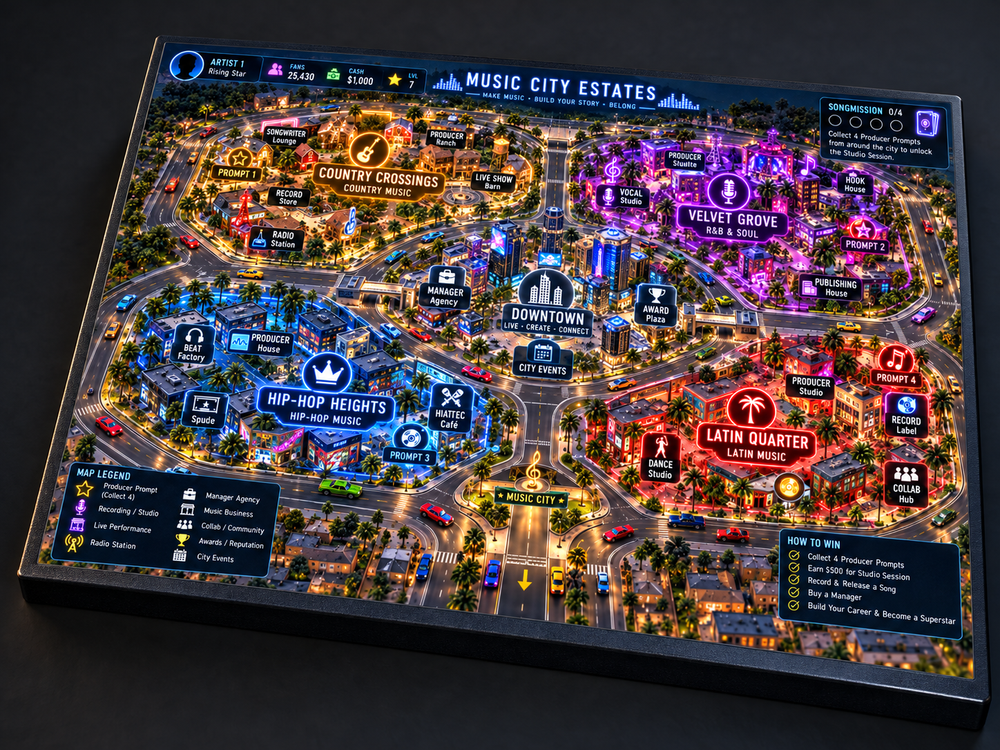

# Music City Estates MVP

A playable browser MVP for a music-career simulation. Start in a bedroom studio, create songs, perform, promote releases, grow a fanbase, and unlock new parts of Music City.

## Run locally

No build step or dependencies are required. From the repository root, start any static file server:

```bash
python3 -m http.server 8000
```

Then open [http://localhost:8000](http://localhost:8000).

The BeGenius Studio entrance opens a walkable 3D executive lobby with a RushDee
plaque gallery, a five-second rotating official YouTube release wall, and a
connection to the universal recording workflow. Release destinations are
configured in `begenius_catalog.js`.

## Gameplay

- **Create Song** to gain XP, fans, and a release.
- **Perform Live** to earn cash, fans, and XP after creating a song.
- **Promote Music** to trade cash for reach.
- **Enter Battle** after reaching 25 fans.
- Use **View City** to track location unlocks.
- Use **View Phone** to see contacts, messages, social activity, and releases.
- Tour the walkable **Word Slaughter Warehouse** battle venue at any fan level; the three-round battle itself unlocks at 25 fans.
- Use **Live Freestyle** from the 3D battle stage for a phone-to-phone WebRTC battle test: Rapper A hosts, Rapper B joins by invite link, fans can listen and vote, and each device runs a synchronized generated beat.
- Explore the Warehouse **Community Space** to meet resident artists, build connections, join a collaboration challenge, showcase releases, and check in with an A&R.
- Visit **Merch & Backstage** for click-ready product displays, optional verified store or sponsor links, and artist battle check-in.
- Perform at the walkable **Hip-Hop Café** to select a release, play a three-part open-mic set, and grow toward the 50-fan venue milestone.

Progress is saved automatically in the browser with `localStorage`.

## The exact approved 3D Fusion Board artwork



The Fusion Board now uses the **actual approved 1448 × 1086 image, unaltered,
byte-for-byte**, on a Three.js 3D board face. The PNG at
`assets/fusion/board-approved-original.png` has SHA-256
`49f4bf27b440f89e88462e615e9cf3a9d452f18e01c48d8787f3120938e00695`.
There is no redraw of lookalike squares or regenerated city geometry.

The 40 invisible landing areas and 3D car locations in
`fusion/fusion-art-map.js` follow the painted roads. Cars are still created
by the existing Detroit-derived vehicle builder, retain their rims/paint,
animate after each dice roll and use the chase/drone camera; ownership rings
appear only when a player owns a location. Tap the built-in producer artwork
or neighborhood marker to inspect it. Use **Menu → Full board view** after
zooming in on a landed car, including on iPhone.

The four producer stops follow the approved image's geography:
**Hip-Hop Heights** (blue lower-left, prompt 3), **Country Crossings**
(gold upper-left, prompt 1), **Velvet Grove** (purple upper-right, prompt 2)
and **Latin Quarter** (red lower-right, prompt 4).
The original `global` internal save key now represents Velvet Grove,
preserving existing players' fourth card and legacy music prompts. Old
board saves rebase street names and visible map artwork while retaining
money, completed laps, songs, managers, vehicles, saved cards and property
owners by stable location ID. The approved artwork shows some illustrative
printed UI: the live HUD above it is the authoritative source of actual
cash, prompts, turns and score.

The existing game loop still requires **four producer prompt cards**,
**two full laps**, a **$500 booked studio session**, a recorded/uploaded song,
and a later full lap plus business ownership/cash for manager access.
The approved image adds no paid AI requirement. Producer exchanges,
PeerJS online rooms and host-authoritative money/career rules remain
unchanged; audio uploads remain private to the artist's own device.

## Fusion board prototype

Open `fusion_board.html` to play the separate four-borough board match. The 40-space board,
cars, dice, producers, property income, manager, radio, and finale are adapted from the
Detroit Empire prototype. Hip-Hop Heights opens the existing walkable street and its rooms
in a board overlay; closing it returns to the same car, space, and turn. Every player
starts with **$1,000** and earns **$200 when passing GO**. The four producer prompts
and **two completed laps** are required before booking a **$500 BeGenius Studio
session**. A session can be booked from the in-game phone from any landed square;
players can then enter the studio from the same phone without rolling a lucky number.

The board's prompt-card song action and the full BeGenius room currently have separate song
state. An experimental online playtest room now uses PeerJS for host-authoritative turns, shared
board state, and text chat inside the in-game phone for up to four players on separate devices.
The host starts a local game, opens the phone, creates a room, and shares its invite; guests join
from the link and claim an available computer seat. Keep the host tab open. Only the host retains
the shared match save; uploaded song audio stays on each artist's device and does not play on
other phones. Voice chat, durable room accounts, reconnects, shared audio, and public-release
moderation need a production backend. Country Crossings, Latin Quarter, and Global Sound have
producer blocks and visible borough entrances, with walkable interiors to follow.

The phone's **Producer Network** displays each artist's four prompt slots. An online
artist who has collected a card can share a copy with a connected human artist
missing that borough's card, even when it is not the sender's turn. The host
validates the sender's actual room seat and the card; recipients cannot receive
duplicate borough cards or change a completed song. Card exchanges appear in room
chat, sync to all players, and remain part of the host's saved board state.
Complete all four prompts to preview/copy the combined song direction from your
phone, then book and pay for BeGenius Studio after completing two laps. You can
enter from any square on your turn after rolling, copy your four-card AI prompt,
and upload the finished song without paying twice. After recording, return to
the board for at least another lap before hiring your manager (requires a music
property and $300). Studio booking and remote guest requests are host-validated.
AI music generation
is not wired into this board; use your chosen authorized generator externally.

**Two-phone playtest:** Phone A starts the board and creates a room from the
in-game phone. Share the invite with Phone B, which opens it, enters an artist
name and joins. Each phone should see the same turn and car positions. Collect
a producer card, open the phone and share it with the other artist; check the
recipient's Producer Network and both chat logs, then close and reopen the phone.
Finally, have the recipient gather all four cards, finish two laps, book a
$500 session from the phone, open the BeGenius prompt lab without landing on its
physical square, then return to the board before hiring a manager.
Keep both browsers online and the host tab open while testing.

**Automated checks:** run `npm test` with Node.js 22. The fusion collaboration
suite checks missing-card and forged offers, off-turn exchanges, host seat
authorization, save/load persistence, GO payouts, two-lap/$500 studio booking,
remote booking and post-recording manager progression. A real two-phone
test remains required before merging the draft PR into `dev`.

The Live Freestyle feature is an MVP test path. It uses PeerJS public signaling so no private game server is required for early phone testing. Production multiplayer should move signaling, identity, moderation, room persistence, and anti-abuse controls to owned infrastructure.

## Project structure

- `index.html` — lightweight launcher that opens the city map.
- `city_map.html` — the main starting screen for the current game world.
- `player-state.js` — shared player progress used by the current map and location pages.
- `sponsor_catalog.js` — optional merchandise, affiliate, and sponsored-placement links used by the 3D Merch Room.
- `begenius_catalog.js` — official YouTube destinations and plaque labels used by the 3D BeGenius lobby.

## Suggested next milestones

1. Add full song creation choices (genre, beat, vocals, polish, title, and cover art).
2. Turn venues into playable rhythm or choice-based performance events.
3. Add battle opponents, fan voting, rewards, and branching outcomes.
4. Add contact relationships, quests, and producer/DJ/A&R storylines.
5. Add authentication and cloud saves once the core loop is validated.

## ElevenLabs review integration

The review build includes a secure ElevenLabs provider layer:

- `elevenlabs_demo.html` — reviewer-facing live API demo.
- `api/elevenlabs/tts.js` — studio engineer Text to Speech.
- `api/elevenlabs/transcribe.js` — Scribe v2 vocal/freestyle transcription.
- `api/elevenlabs/status.js` — server-side credential validation without exposing the key.
- `api/music/generate.js` — Eleven Music v2.5 generation adapter.
- `api/music/reference.js` — Eleven Music audio-reference upload adapter.
- `record_music.html` — ElevenLabs-first studio workflow with Music City Native kept as an offline fallback.

Required server environment variables:

```text
ELEVENLABS_API_KEY=your_server_side_key
ELEVENLABS_MUSIC_MODEL=music_v2_5
ELEVENLABS_TTS_MODEL=eleven_flash_v2_5
ELEVENLABS_STT_MODEL=scribe_v2
ELEVENLABS_VOICE_ID=optional_voice_id
```

Never place the ElevenLabs API key in GitHub, HTML, client JavaScript, or a query string. The Music API itself is subject to the ElevenLabs account's API entitlement.
